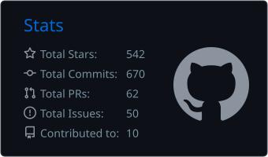
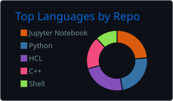

<h1 align="center">Hi, I'm Rishav Nandi</h1>
<h3 align="center">Python Backend & Platform Engineer | DevOps | Homelab Enthusiast</h3>

- All of my projects are available at [My Portfolio](https://www.rishavnandi.com)

- How to reach me 

# What I Do

I write Python backend services and automate infrastructure. I also run a homelab where I break things and (usually) fix them.

# Tech Stack

### Languages & Runtime
  

### Web & API
 

### Data & Messaging
  

### AI & Agents
  

### Containers & Orchestration
 

### Infrastructure & Automation
  

### Observability
 

### Cloud & OS
 

# GitHub Stats
|  |  |
| --- | --- |

# Socials

